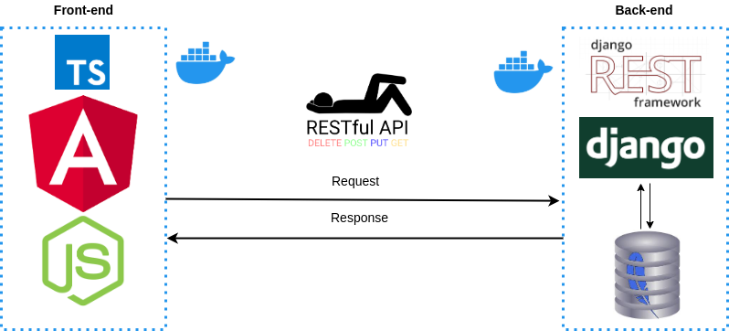
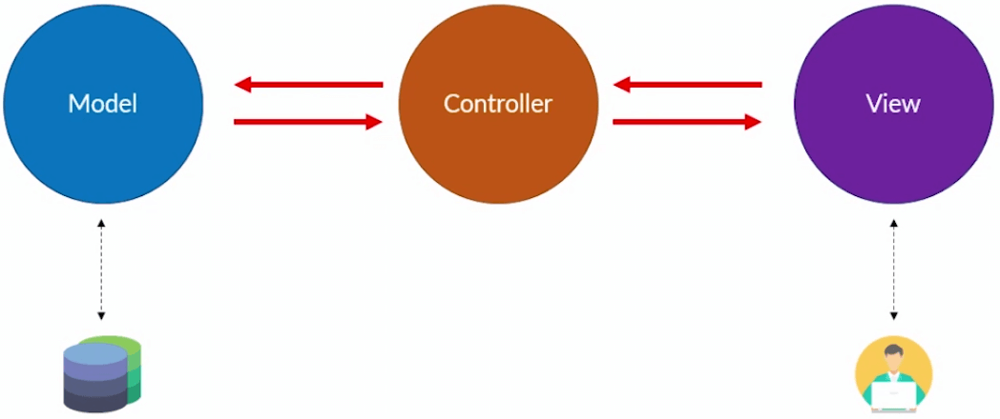
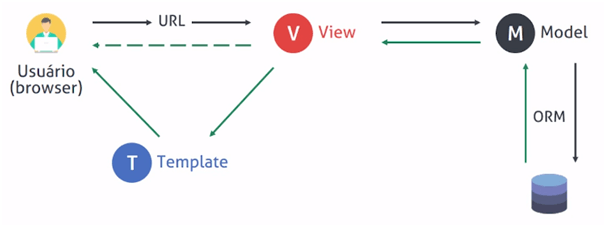
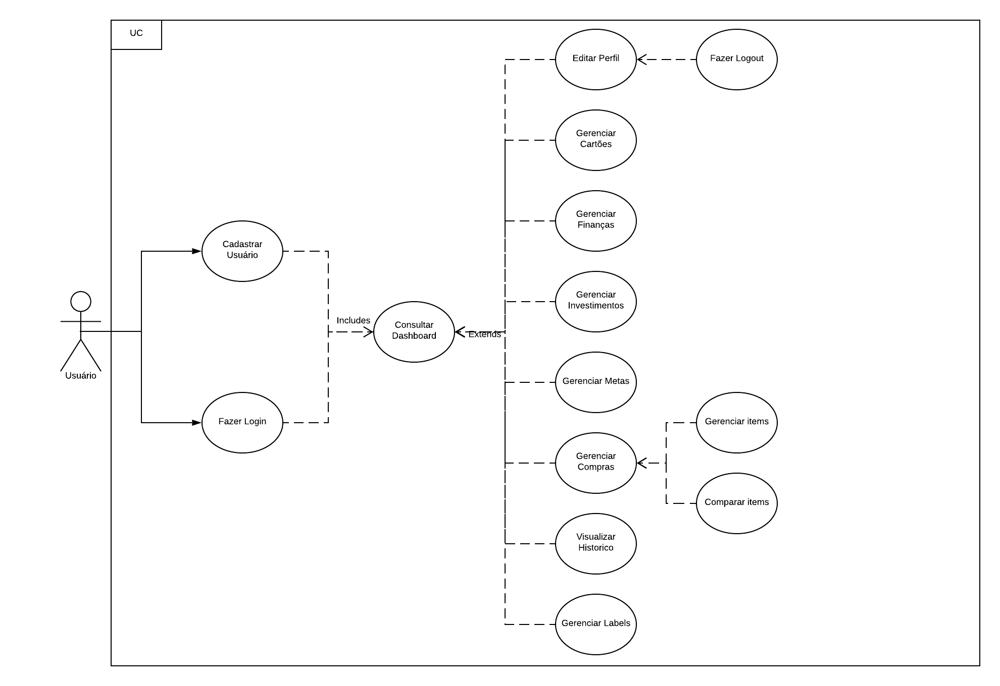

# Documento de Arquitetura

## Historico de versão

 Data | Versão | Descrição | Autor
 ---- | ------ | --------- | -----
29/05/20 | 1.0 | Abertura do documento, criação da introdução| Giovanna

## Índice

1. [Introdução](#1)
    1. [Finalidade](#1.1)
    2. [Escopo](#1.2)
    3. [Definições, acrônimos, abreviações](#1.3)
2. [Representação da arquitetura](#2)
    1. [Back-end](#2.1)
        1. [MVC](#2.1.1)
        2. [MTV](#2.1.1)
    2. [Front-end](#2.2)
3. [Metas e Restrições de Arquitetura](#3)
3. [Visão de casos de uso](#4)

13. [Referências](#13)

# Introdução 

## Finalidade 
Este documento tem como finalidade apresentar a arquitetura do projeto **E a Economia**, para registrar decisões relacionadas ao projeto através de diversas visões. O documento é dividido da seguinte forma: primeiramente a representação da arquitetura da solução é apresentada, em seguida metas e restrições desta arquitetura e por fim as visões sobre elementos da arquitetura.
## Escopo 
Este documento apresenta as características arquiteturais do projeto **E a Economia**, descrevendo em detalhes a soluções arquiteturais determinadas para o projeto, de forma a servir como base para o desenvolvimento do projeto pelos desenvolvedores de software alocados para o projeto.
## Definições, acrônimos, abreviações 
**MVC** - Model View Controller

**MTV** - Model Template View

**Django** - Framework da linguagem python para a construção rápida de aplicativos web, fornecendo componentes prontos e com fácil uso.

**HTTP** - Prototocolo de comunicação utilizado para sistemas de informação.

**REST** - Ferramenta que auxilia a utilização do protocolo http.

**Angular** - Framework de front-end que visa aumentar a produtividade no que diz respeito ao ao front-end do projeto.

**Docker** - Ferramenta utilizada para modularizar os processos do desenvolvimento do software para eliminiar as inconsistências do ambiente de desenvolvimento.

**E a Economia** - É uma aplicação movel, desenvolvido em Django REST e Angular, que te auxilia a controlar suas finanças e saber para onde seu dinheiro está indo. Monitorar seus gastos em poucos minutos com personalização completa.

# Representação da arquitetura 

## Back-end 

O sistema faz uso do Framework Django (versão 2.2.2), que faz uso do padrão MVC. No entanto, tal plataforma possui uma interpretação singular em relação à organização de camadas. O indicado é considerar que a própria plataforma faz o papel da camada de controle, enquanto a camada de Modelo e de Visão devem ser adaptadas e reinterpretadas conforme o necessário. Por este motivo, ainda que o Django implemente o MVC, considera-se que o padrão de camadas externalizado pela plataforma é o MTV (Model-Template-View). Para auxiliar no protocolo http utilizamos a ferramenta REST.
A utilização de uma arquitetura em camadas é interessante por proporcionar uma clara separação de responsabilidades no código, proporcionando reusabilidade, e reduzindo o esforço de manutenção. Os conceitos de MVC e MTV serão apresentados nas seções seguintes.

### MVC 

Padrão arquitetural MVC.

* **Model:** camada de acesso a base de dados, é responsável pela leitura, manipulação e validação dados;

* **Controller:** é responsável por manipular e validar as requisições do usuário, traduzindo em comandos enviados para enviados para a Model e/ou View .

* **View:** camada de interface com o usuário, responsável pela representação dos dados;
### MTV 
 

Padrão arquitetural MTV.

* **Model:** segue a mesma definição da model no MVC;

* **Template:** segue a mesma definição da view no MVC;

* **View:** segue a mesma definição da controller no MVC.

## Front-end 
O sistema faz uso do angular 8, que traz vantagens como: componetização, módulos específicos para configurar PWA, sistema de rotas de páginas, framework material para parte de design do site.
# Metas e Restrições de Arquitetura 
Restrição|Descrição
:---------:|:----------
Linguagem|O sistema será desenvolvido utilizando a linguagem Typescript para o front-end e a linguagem Python para o back-end.
Plataforma|Será utilizado o framework Angular para o front-end e o framework Django para o back-end.
Segurança|Todas as senhas cadastradas serão criptogradas, para uma maior segurança para o usuário.
Persistência|Será utilizado o banco de dados SQLite3 para a persistência dos dados.
Arquitetura|Será feita uma arquitetura de microserviços, já que facilita a escalabilidade do sistema e simplifica o deploy de componentes separados do sistema.
Portabilidade|O projeto é uma aplicação web, o que facilita a portabilidade entre sistemas, sendo acessado através do navegador. Entretanto, não possui portabilidade para mobile.
Distribuição|Sempre será disponibilizada ao usuário a última versão da API, já que a distribuição sempre ocorrerá assim que a nova versão do software é enviada para produção.
Reuso|A utilização dos frameworks Django e Angular certificam um bom reuso devido à padronização da criação de componentes do código.

# Visão de casos de uso
 

# Referências 

* Software Architecture: MVC Design Pattern, Medium. Disponível em: //medium.com/@dennisvera.z/software-architecture-mvc-design-pattern-ceae5d5083d7)).
* Django's Structure – A Heretic's Eye View, The django book. Disponível em: <https://djangobook.com/mdj2-django-structure/>
