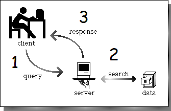

# Documento de Arquitetura

## Historico de Versões

| Data | Versão | Autor(a) | Descrição |
| - | - | - | - |
| 20/10/2020 | 0.1 | João Gabriel | Abertura do documento|
| 20/10/2020 | 0.2 | João Gabriel | Adiciona Representação de Arquitetura,Restriçoes e Visão Lógica|

## Indice

- [1. Introdução](#_1-introdução)
  - [1.1. Objetivos](#_11-objetivos)
  - [1.2. Escopo do documento](#_12-escopo-do-documento)
- [2. Representação da Arquitetura](#_2-representação-da-arquitetura)
- [3. Restrições](#_3-restrições)
- [4. Visão Lógica](#_4-visão-lógica)
  - [4.1. Visão Geral: Pacotes e Camadas](#_41-visão-geral-pacotes-e-camadas)
  - [4.2. Visão Geral: Classes](#_42-visão-geral-classes)

## 1. Introdução

### 1.1. Objetivos

O objetivo deste documento é detalhar a arquitetura e tecnologias utilizadas no projeto,que se trata de uma aplicação web de controle de finanças pessoais.

### 1.2. Escopo do documento

Este documento contém detalhes sobre a arquitetura escolhida para o sistema, as lógicas por trás das implementações, as linguagens/tecnologias usadas, os padrões estabelecidos pela equipe, informações referentes à bancos de dados, além dos  diagramas de classe e de caso de uso.

## 2. Representação da Arquitetura

A arquitetura utilizada no projeto é a arquitetura Cliente/Servidor, que se baseia na relação de dois módulos, o cliente e o servidor. O servidor será responsável pela manutenção e processamento dos dados, enquanto ao cliente será encarregada a função de fornecer os dados.

No caso deste projeto, o papel de cliente será desempenhado pelo frontend da aplicação, que está sendo implementado em React, e o de servidor pela API, implementada em Node.js, que faz toda a comunicação com a camada de persistência dos dados.

## 3. Restrições

O sistema será desenvolvido para ser utilizado em web browsers Para alcançar tal finalidade, o backend do sistema, API que fará a comunicação com o banco de dados, será desenvolvido utilizando o Node.js com o framework Express e o frontend, que fará interface com o usuário final, pelo Cliente (em React).

## 4. Visão Lógica

### 4.1. Visão Geral: Pacotes e Camadas

A arquitetura Cliente/Servidor se baseia em dois módulos principais, que farão a comunicação entre si para fornecer ao usuário os serviços necessários. No caso deste projeto, o cliente será a aplicação React e o servidor a API REST desenvolvida em Node.js, que utiliza o modelo MVC por padrão e possui módulos internos bem definidos (models, views, controllers, database, etc.). É válido ressaltar que como se trata de uma API REST, o servidor da aplicação não fará uso das views do modelo MVC utilizado pelo Node.

A figura a seguir mostra a estrutura de pacotes do sistema:

(POR FAZER)

### 4.2. Visão Geral: Classes

O diagrama de classes a seguir tem como finalidade demonstrar todas classes, atributos, métodos e tipo de restrição de acesso dos dados utilizados.

Segue o diagrama de classes:

(POR FAZER)
