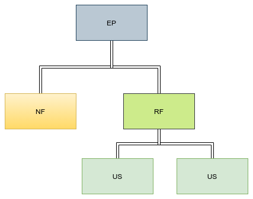

# Plano de gerenciamento de requisitos

## Historico de versão

| Data | Versão | Descrição | Autor|
| ---- | ------ | --------- | -----|
|02/11/20 | 1.0 | Abertura do documento | João Gabriel|
|08/11/20 | 1.1 | Adição do indice | João Gabriel|

## Indice

- [1. coleta de requisitos](#_1-coleta-de-requisitos)
  - [1.1 Definir técnicas de elicitação](#_1.1-Definir-técnicas-de-elicitação)
  - [1.2 Planejamento de elicitação](#_1.2-Planejamento-de-elicitação)
  - [1.3 Reunião de elicitação](#_1.3-Reunião-de-elicitação)
  - [1.4 Análise dos requisitos](#_1.4-Análise-dos-requisitos)
  - [1.5 Documentação](#_1.5-Documentação)
- [2. Priorização de requisitos](#_2-Priorização-de-requisitos)
  - [2.1 Matriz de rastreablidade](#_2.1-Matriz-de-rastreablidade)
  - [2.2 Priorização de requisitos](#_2.2-Priorização-de-requisitos)
  - [2.3 Reavaliação de prioridade](#_2.3-Reavaliação-de-prioridade)

## 1. coleta de requisitos

### 1.1 Definir técnicas de elicitação

Nesta etapa serão definidas as técnicas de elicitação de requisitos a serem usadas pela equipe.

### 1.2 Planejamento de elicitação

Como a técnica escolhida para elicitar requisitos foi o brainstorming, cada membro da equipe deverá pesquisar sobre aplicações com propósitos similares e refletir sobre as questões que serão trazidas para a reunião de elicitação.

### 1.3 Reunião de elicitação

Neste momento haverá uma sessão de brainstorming entre os membros da equipe onde serão trazidas as questões elaboradas pelos mesmos e ocorrera a discussões sobre possíveis funcionalidades, tecnologias a serem usadas e questões de performance.

### 1.4 Análise dos requisitos

Neste momento será verificado se todos os requsitos coletados são viaveis , se existem requisitos conflitantes entre si e se todos os requisitos elicitados estão dentro do escopo do projeto.

### 1.5 Documentação

Após a análise, serão formalizados os Épicos e seus requisitos, e criadas as Histórias de Usuário, além da criação do(s) protótipo(s) de baixa fidelidade.

## 2. Priorização de requisitos

### 2.1 Matriz de rastreablidade

Primeiramente ocorrerá a elaboração de matriz de rastreabilidade conforme abaixo:

- EP = Epicos
- RF = Requisitos funcional
- NF = Requisitos não-funcional
- US = Historias de Usuario (user stories)

Obs: os IDs serão o codigo mais um numero que representa a ordem de definição de cada parte (ex: primeiro Epico será EP01, o segundo será EP02, a primeira Historia de Usuario será US01, a segunda será US02, e assim em diante).
Obs2: As matrizes de rastreabilidade se encontram no Documento de visão.

### 2.2 Priorização de requisitos

Nesta etapa serão definidas as prioridades das Historias de Usuario, conforme sua relevancia para a continuidade das outras etapas do projeto e sua importancia para as entregas a serem feitas.

### 2.3 Reavaliação de prioridade

Após a finalização de cada sprint, na reunião de planejamento da seguinte, os membros da equipe podem questionar e reavaliar a prioridade do que ainda sera desenvolvido com base na produtividade obtitida até o dito momento e possivel mudança nos requisitos.
